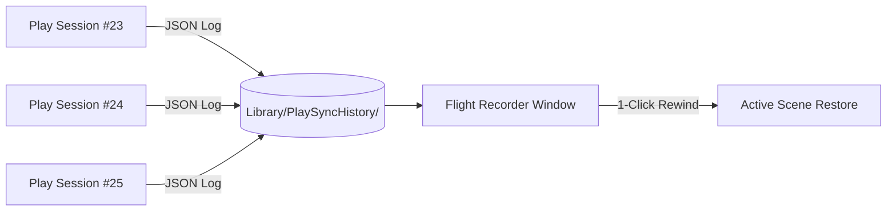

# 25-Session Flight Recorder
{: .no_toc }

Have you ever spent an hour tuning vehicle handling or boss mechanics, exited Play Mode without saving, and realized the perfect configuration was lost? PlaySync Pro's **Flight Recorder** acts as an automatic time machine, recording your past 25 play sessions.

---

## Table of Contents
{: .no_toc .text-delta }

1. TOC
{:toc}

---

## How the Flight Recorder Works



* **Automatic Background Logging:** Every time you exit Play Mode with tracked changes, PlaySync Pro serializes an immutable timestamped `.json` session record.
* **Stored in Project Library:** History files reside in `[Project]/Library/PlaySyncHistory/`. They remain locally available across editor restarts without polluting your Git repository or asset folders.
* **Rolling Buffer:** Automatically retains the most recent 25 sessions (configurable up to 100 sessions in Settings).

---

## Navigating Flight History

Open `Tools > ByteLura > PlaySync > Flight Recorder (History)` (or the **Flight Recorder** tab in PlaySync Studio):

```text
┌────────────────────────────────────────────────────────────────────────┐
│  25-Session Flight Recorder (Time Machine)                             │
├────────────────────────────────────────────────────────────────────────┤
│  Recorded Sessions: 6                                                  │
│  ┌───────────────────────────────────────────────────────────────────┐ │
│  │ 📜 Session #6 - Sat, Aug 15 01:42:40 (9 Changes) [Restore Session]│ │
│  │ 📜 Session #5 - Sat, Aug 15 01:38:12 (4 Changes) [Restore Session]│ │
│  │ 📜 Session #4 - Sat, Aug 15 01:25:50 (12 Changes)[Restore Session]│ │
│  │ 📜 Session #3 - Sat, Aug 15 00:54:02 (7 Changes) [Restore Session]│ │
│  └───────────────────────────────────────────────────────────────────┘ │
└────────────────────────────────────────────────────────────────────────┘
```

### Inspecting Past Sessions
* Click on any past session to expand its full change audit.
* View exact timestamps, modified GameObject names, component types, and `WAS -> NOW` parameter values.
* Click **Restore Session** to load that past session's state directly into your current active scene with full Undo support.

---

## Exporting & Archiving

* **Export Session JSON:** Save any specific historical run as a standalone `.json` file to archive in project documentation or attach to a bug report.
* **Clear Old Sessions:** One-click utility button to purge local history cache when starting a new milestone.

> **Pro Tip:** Because the Flight Recorder stores history in the Unity `Library/` directory, deleting your project's `Library/` folder will reset the history without affecting any saved `.asset` Presets.
