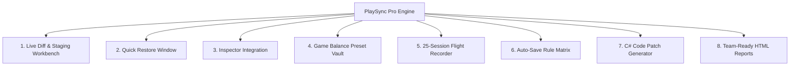

# Core Features
{: .no_toc }

PlaySync Pro is architected as an integrated 8-module suite designed to eliminate friction in game balance, level design, and runtime iteration.

---

## The 8 Core Modules

### [1. Live Diff & Staging Workbench](live-diff-workbench/)
The master 6-tab control panel for deep real-time parameter inspection, search filtering, and granular selective commits across Transforms, Colliders, Audio, and MonoBehaviours.

### [2. Quick Restore Window](quick-restore-window/)
The non-intrusive popup stager that triggers on Play Mode exit with built-in scene conflict warnings and 100% undo support.

### [3. Direct Inspector Integration](inspector-integration/)
In-inspector change notification headers and right-click context menu helpers allowing you to commit single objects without opening full tool windows.

### [4. Game Balance Preset Vault](preset-vault/)
Store complete gameplay configurations as ScriptableObject assets (`.asset`) for instant A/B balancing, multi-scene distribution, and team sharing.

### [5. 25-Session Flight Recorder](flight-recorder/)
An automatic local time machine that stores your previous 25 play sessions in `Library/PlaySyncHistory/`, allowing you to rewind and restore past gameplay experiments.

### [6. Zero-Click Auto-Save Rule Matrix](autosave-matrix/)
Set persistence rules by Component Type, GameObject Tag, or C# `[AutoSavePlayMode]` attribute to automatically persist values with zero prompting.

### [7. C# Initialization Patch Generator](csharp-patch-generator/)
Instantly convert runtime vectors, colors, and script values into clean, production-ready C# code snippets with 1-click clipboard copying.

### [8. Team-Ready HTML Change Reports](html-reports/)
Generate beautiful, self-contained dark-mode HTML reports with category summaries and side-by-side diff tables for pull requests, QA reviews, and game design handoffs.
