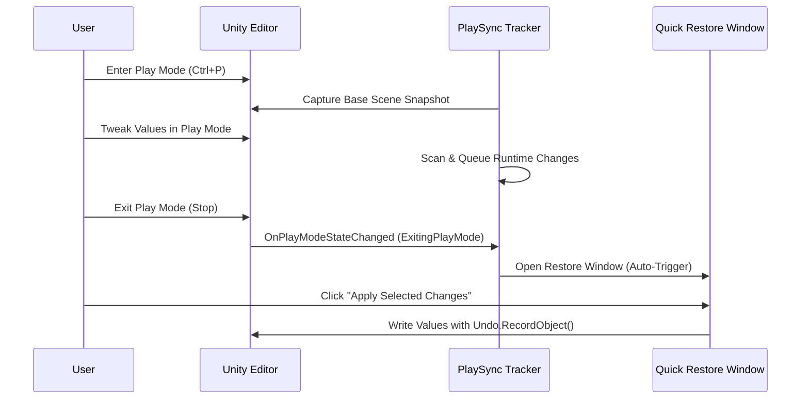

# Quick Restore Window
{: .no_toc }

The **Quick Restore Window** is PlaySync Pro's primary zero-friction interface. It automatically pops up the exact moment you exit Play Mode if any parameter tweaks were detected during your session.

---

## Table of Contents
{: .no_toc .text-delta }

1. TOC
{:toc}

---

## The Exit Staging Workflow



---

## Smart Scene Conflict Guard

A common risk when restoring runtime changes is accidentally overwriting manual adjustments made in Edit Mode. PlaySync Pro includes a built-in **Conflict Guard**:

* **Clean State:** If an object has not been altered in Edit Mode, its row shows a clean green status icon and is marked safe for 1-click restore.
* **Conflict State:** If you altered a property in Edit Mode after stopping Play Mode, PlaySync Pro flags the property with an **Amber Warning**:
  `⚠️ Scene Value Modified Since Exit. Original: (0,0,0) | Edit Mode: (1,1,1) | Staged: (5,5,5)`
* You can choose whether to overwrite with the staged runtime value or retain the Edit Mode edit.

---

## Toolbar & Quick Actions

The Quick Restore Window features a responsive 3-row toolbar:

* **Select All / Deselect All:** Quickly toggle all checkboxes across all tracked GameObjects.
* **Filter Tabs:** Toggle between `All Changes`, `Transforms`, `Scripts`, `Components`, and `Prefabs`.
* **Search Bar:** Real-time search filter by GameObject name or component property name.
* **Apply Selected Changes:** Commits checked properties to your active Edit Mode scene.
* **Restore All Safe:** Bypasses any conflicted properties and applies only 100% safe changes.
* **Discard All:** Clears the current staging queue without modifying the scene.
* **Studio (Full Suite) Link:** One-click button in the header to expand into the full 6-tab **PlaySync Studio**.

---

## 100% Native Undo Integration

Every change committed through the Quick Restore Window is registered with Unity's native `Undo.RecordObject()` system:

```csharp
// Internal commit mechanism ensuring full Ctrl+Z safety:
Undo.RecordObject(targetComponent, "PlaySync Restore Parameter");
ApplyPropertySnapshot(targetComponent, stagedChange);
EditorUtility.SetDirty(targetComponent);
```

> **Pro Tip:** If you ever commit a batch of changes by accident, simply press `Ctrl+Z` / `Cmd+Z` in the Unity Editor to revert every modified object back to its pre-restore state!
