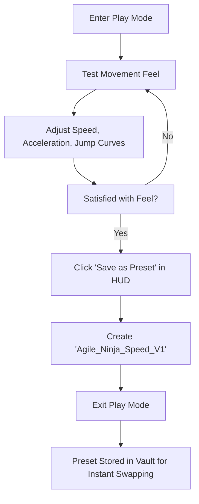

# Game Balancing & A/B Iteration
{: .no_toc }

Fine-tuning player movement feel, combat timing, and weapon recoil requires dozens of rapid iterations. This recipe shows how to use PlaySync Pro to balance mechanics without manual note-taking.

---

## Table of Contents
{: .no_toc .text-delta }

1. TOC
{:toc}

---

## The Challenge

Game balance values (acceleration curves, friction, recoil kickback) can only be truly evaluated while playing the game. In standard Unity:
1. You hit Play, test a jump, pause, tweak values in Inspector.
2. You test again, like the result, but must manually write down `0.42`, `18.5`, `3.2` on a notepad.
3. You exit Play Mode and re-type the numbers. If you forget one field, the whole feel breaks.

---

## The PlaySync Pro Workflow

### Step-by-Step Walkthrough

1. **Tag Balancing Fields:** Add `[AutoSavePlayMode]` or ensure fields are public / `[SerializeField]` on your player controller.
2. **Open PlaySync Studio:** Dock `PlaySync Studio` next to your Game view.
3. **Live Tweaking:** As you play, adjust movement sliders. Watch the Live Diff tree reflect your changes in green.
4. **Capture Multiple Variants:**
   * Create Preset A: `Heavy_Tank_Profile`
   * Create Preset B: `High_Speed_Scout_Profile`
5. **A/B Testing:** Switch between presets with 1-click in the Preset Vault to compare how different gameplay archetypes perform on the same level layout.

> **Pro Tip:** Generate an **HTML Report** before sending your balance presets to testers so they have full visibility into the numerical adjustments.
