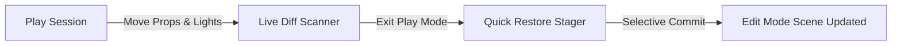

# Level Design & Lighting Staging
{: .no_toc }

Level designers and lighting artists frequently need to test environmental scale, shadow angles, and collider volumes with an active character running in the scene.

---

## Table of Contents
{: .no_toc .text-delta }

1. TOC
{:toc}

---

## The Workflow

### 1. Environmental Prop Placement
* Run your character through an obstacle course in Play Mode.
* When you notice a jump gap is too wide, pause or grab the platform in the SceneView and move it closer.
* Adjust platform rotation and scale.
* Upon exiting Play Mode, select **Filter: Transforms** in the Quick Restore Window and click **Apply Selected Changes**.

### 2. Real-Time Lighting Tweaks
* Adjust PointLight / SpotLight intensities, shadows, and ranges while walking through dark corridors.
* Add `UnityEngine.Light` to your **Auto-Save Rule Matrix** to ensure all light adjustments persist immediately without prompting.

### 3. Precision Collider Alignment
* When fine-tuning trigger zones or boundary colliders, adjust the `BoxCollider.size` or `BoxCollider.center` while observing physics triggers firing in the console.
* Commit the collider parameters directly via the Inspector's **Apply Now** button.
