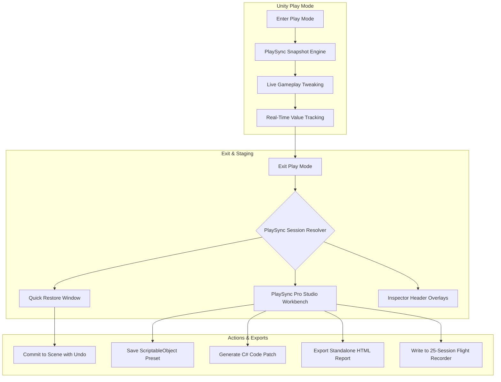

# PlaySync Pro Documentation
{: .no_toc }

**Tweak in Real Time. Persist with Confidence.**
{: .fs-6 .fw-300 }

PlaySync Pro is an enterprise-grade Unity Editor extension that solves one of game development's most persistent headaches: lost runtime parameter tweaks. Modify GameObjects, adjust physics balances, tune AI speeds, and test lighting conditions in Play Mode—then selectively stage, diff, and commit those changes directly back into your Edit Mode scene with 100% clean Unity Undo support.

[Get Started]({{ '/docs/getting-started.html' | relative_url }}){: .btn .btn-primary .fs-5 .mb-4 .mb-md-0 .mr-2 }
[View on Asset Store](https://assetstore.unity.com/publishers/128366){: .btn .fs-5 .mb-4 .mb-md-0 }

---

## Table of Contents
{: .no_toc .text-delta }

1. TOC
{:toc}

---

## Pain vs. Solution

| The Developer Pain | The PlaySync Pro Solution |
|:---|:---|
| **Lost Tweaks:** You spend 30 minutes fine-tuning jump curves and enemy velocities in Play Mode, only to watch every change vanish when you hit Stop. | **Automatic Exit Detection:** Non-intrusive popup stager captures every altered parameter the moment you exit Play Mode. |
| **All-or-Nothing Overwrites:** Traditional tools blindly overwrite whole components, corrupting newly generated runtime references or scene edits. | **Granular Field Diffs:** Color-coded `WAS -> NOW` visual inspection tree allows committing individual fields, single objects, or all safe changes. |
| **Lost Balance Experiments:** Testing 5 different vehicle suspension setups requires manual note-taking or duplicate scene files. | **ScriptableObject Preset Vault:** Save complete runtime balance snapshots directly into your project for instant A/B swapping anytime. |
| **Forgotten "Golden Runs":** That perfect physics run from 3 play sessions ago is permanently lost. | **25-Session Flight Recorder:** Built-in time machine automatically logs past play runs in local project cache for instant rewind and restoration. |
| **Manual Code Sync:** Copying runtime vectors and color codes into procedural C# scripts is tedious and prone to typos. | **1-Click C# Patch Gen:** Automatically converts runtime property tweaks into clean, production-ready C# code initialization blocks. |
| **PR & QA Friction:** Explaining game balance tweaks to designers and QA leads requires lengthy Slack messages. | **Team HTML Reports:** Generates self-contained, dark-theme HTML reports with category summaries and side-by-side diff tables in 1 second. |

---

## Architecture Overview

PlaySync Pro operates via a non-allocating editor tracking loop that monitors active scene components without degrading play session frame rates.

---

## Key Feature Highlights

### 1. Live Diff & Staging Workbench
A complete 6-tab control center providing a visual side-by-side tree of all altered Transforms, Physics Colliders, Audio, Lights, and Custom MonoBehaviours with active search and category filters.

### 2. Instant Play Mode Exit Stager
A dedicated lightweight popup that triggers upon exiting Play Mode, presenting all staged changes with smart conflict warnings and 1-click safe commit.

### 3. Native Unity Inspector Integration
Contextual change headers embedded right inside standard Component Inspectors, enabling single-click "Apply Now" commits without opening any auxiliary windows.

### 4. Game Balance Preset Vault
Save complete game balance configurations into project assets (`.asset`) to instantly swap, compare, and A/B test parameter sets across different play sessions and scenes.

### 5. 25-Session Flight Recorder
An automated local time machine stored in `Library/PlaySyncHistory/` that tracks your past 25 play runs so you can rewind and restore tweaks made hours earlier.

### 6. Zero-Click Auto-Save Rule Matrix
Set persistence rules by Component Type, GameObject Tag, or decorate scripts with `[AutoSavePlayMode]` to automatically persist values with zero prompting.

---

## Compatibility & Requirements

* **Unity Versions:** Unity 2021.3 LTS, Unity 2022.3 LTS, Unity 6 (6000.x) and newer.
* **Render Pipelines:** Universal Render Pipeline (URP), High Definition Render Pipeline (HDRP), Built-in Render Pipeline.
* **Platforms:** Windows, macOS, Linux (Unity Editor).
* **Dependencies:** None. Zero third-party package dependencies.
